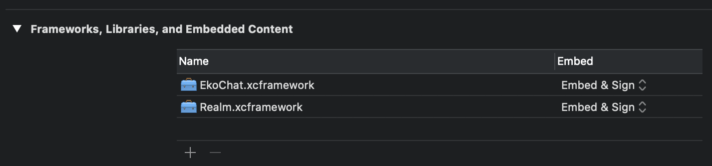

# Amity Social Cloud SDK Sample Application

  

This sample app is designed to showcase our Amity iOS SDK. If you are checking out sample app for sdk version below 5.0.0, please follow this [README for sdk version < 5.0.0](/README-OLD.md)

## Getting Started
We distribute our `AmitySDK` and its dependency `Realm` as an `.xcframework` file. You can download it from [Download Link](https://s3-ap-southeast-1.amazonaws.com/ekosdk-release/ios/amitysdk.zip)

## Installation

1. Add `AmitySDK.xcframework` and `Realm.xcframework` file into the sample app xcode project under `Framework, Libraries & Embedded Content` section.

2. Build and Run the project

## Api Key

You can add your `api-key` in `info.plist` file for the sample app. Replace the content of this property `AmityAPIKey` with your api key.

## License

Public Framework. Copyright (c) 2020 [Amity](https://amity.co).
